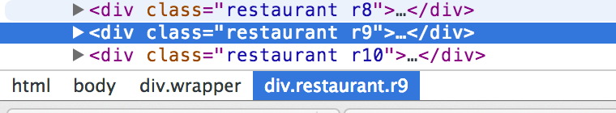

# Learn to Scrape!

## Intro

In this short tutorial, we'll be learning the basics of using the [Nokogiri](http://nokogiri.org/) gem by scraping a small portion of a website about Financial District dining options (made by a Flatiron HS student!). Here's the site (open it now in a new tab):

<a href="https://s3-us-west-2.amazonaws.com/nokogiri-scrape/index.html" target="_blank">Fidi Dining</a>

First, we'll learn how to make an http request using Ruby's [Open-URI](http://ruby-doc.org/stdlib-2.1.0/libdoc/open-uri/rdoc/OpenURI.html) module. Then, we'll learn how to convert that response into a `Nokogiri::HTML::Document` object, collect the data we're interested in, and store it into a data structure of our choosing.

## Assumptions

This guide assumes basic Ruby knowlege and familiarity with nested data structures. If you need a refresher on hashes and arrays, consider reviewing them on the [Codecademy](http://codecademy.com) Ruby track.

## Getting Started

The first thing we need to do is set up our project. Normally, we'd want to test drive the development of this program, but for the purposes of this guide, we'll skip that. We're going to be coding our solutions in fidi_scraper.rb.

To be able to use either Nokogiri or Open-URI, we're going to need to make sure we require them both at the top of our file. So on the first two lines of `fidi_scraper.rb`, add the following:

```ruby
require 'nokogiri'
require 'open-uri'
```

(If you haven't already done so, now would be the time to make sure you install Nokogiri by running `gem install nokogiri` from your command line.)

### What is Open-URI?

Open-URI is a module in Ruby that allows us to programatically make http requests. It gives us a bunch of useful methods to make different types of requests, but for this guide, we're interested in only one: `open`. This method takes one argument, a url, and will return to us the HTML content of that url.

In other words, running:

```ruby
fidi_html = open('https://s3-us-west-2.amazonaws.com/nokogiri-scrape/index.html')
```

stores the HTML of our site into a variable called fidi_html.

### And Nokogiri? What's that?

From the [Nokogiri](http://nokogiri.org/) website:

> Nokogiri (鋸) is an HTML, XML, SAX, and Reader parser. Among Nokogiri’s many features is the ability to search documents via XPath or CSS3 selectors.

Essentially, Nokogiri allows us to treat a huge string of HTML as if it were a bunch of nested data structures. This means that we can access any HTML element on a given page via handy dot-notation. We can do all of this without any ugly regular expressions, all via CSS selectors. It's amazing!

## First Steps

The best way to play around with unfamilar modules and gems is to play around with them! Let's jump into IRB (type `irb` from your command line) and see if we can figure out how they work.

Once you open IRB, type `require 'open-uri'`, press Return, and then type `require 'nokogiri'` followed by another Return. Just like we did at the top of our `fidi_scraper.rb` file, we need to load both the Open-URI module and the Nokogiri gem into our environment.

After each of those lines, IRB should respond with:

```ruby
=> true
```

If it doesn't, check to make sure that your environment is set up properly and that Nokogiri is indeed installed on your system.

Let's start with Open-URI. Create a variable, `fidi_html`, and set it equal to the following line of code:

```ruby
fidi_html = open('https://s3-us-west-2.amazonaws.com/nokogiri-scrape/index.html')
```

You should see some output similar to this:

```
#<File:/var/folders/j8/141_clfx1cz88f86y8ggfd2c0000gn/T/open-uri20140210-1226-9l2b5d>
-rw-------  1 loganhasson  staff  11072 Feb 10 19:38 /var/folders/j8/141_clfx1cz88f86y8ggfd2c0000gn/T/open-uri20140210-1226-9l2b5d
```

The formatting may be different in your case. But what has happened is that Open-URI has made an http request to the site and stored the response in a temporary file.

To see what that HTML looks like, we can call the `read` method on that file. Since we've stored it in the `fidi_html` variable, we can see the raw HTML like this:

```
fidi_html.read
```

You'll get a huge amout of ugly HTML, the top of which will look something like:

```
"<!DOCTYPE html>\n<html>\n<head>\n\t<meta charset=\"UTF-8\">\n\t<title>Fidi Dining</title>\n\t<meta name=\"author\" content=\"name\">\n\t<link rel=\"stylesheet\" href=\"css/styles.css\" type=\"text/css\">\n\t<link rel=\"stylesheet\" href=\"css/reset.css\" type=\"text/css\">\n\t<meta name=\"viewport\" content=\"width=device-width, initial-scale=1\">\n</head>\n<body>\n\t<div class=\"header\">\n\t\t<h1>Fidi Dining</h1>\n\t</div>\n\t<div class=\"wrapper\">...
```

Gross. Can you imagine if we needed to parse through that manually? Just thinking about the regular expressions involved makes my head hurt.

##Nokogiri to the rescue!

Don't worry about this syntax too much now, but the Nokogiri gem gives us this cool method, `Nokogiri::HTML` that takes an HTML string and converts it into this giant NodeSet (aka, a bunch of nested "nodes") that we can easily play around with.

Let's use that `html` variable again and pass it to the `Nokogiri::HTML` classes and see what happens:

```
fidi_nokogiri = Nokogiri::HTML(fidi_html)
```

You should see a bunch of output, the top of which looks something like:

```
#<Nokogiri::HTML::Document:0x811468ac name="document" children=[#<Nokogiri::XML::DTD:0x8114635c name="html">, #<Nokogiri::XML::Element:0x811460f0 name="html" attributes=[#<Nokogiri::XML::Attr:0x8114608c name="itemscope">...
```

If you don't see that output (and instead something really short), it may be because that temporary file from earlier got deleted. Just run 
`fidi_html = open('https://s3-us-west-2.amazonaws.com/nokogiri-scrape/index.html')` again, followed by `fidi_nokogiri = Nokogiri::HTML(fidi_html)` and you should be fine.

This returns to us a giant object that consists of nested "nodes" (nested arrays and hashes) that we can drill down into using CSS selectors. Let's see if we can do something useful with it.

In your browser, visit `https://s3-us-west-2.amazonaws.com/nokogiri-scrape/index.html`. Let's see if we can use this Nokogiri object to store the text from one of the buttons (say, the search button) into a variable. Not terribly exciting, but useful to demonstrate how Nokogiri gets stuff done.

Hopefully you're using Chrome. If you are, right click on the 'Fidi Dining' header, and select 'Inspect Element'. You should see something like:

```html
<h1>Fidi Dining</h1>
```

What this tells us is that the page header is in an `<h1>` element.

Let's find the restaurant name for Luke's Lobster by doing the same thing.

Right click on Luke's lobster, and choose 'inspect element.' You can see that the information on Luke's is in a `div` with a class of "restaurant" and another class "r4". If we were to write this in css, we'd say:

`div.restaurant.r4`

Chrome Web tools actually makes this very easy for you. If you select the node you want and look at the bottom of the web tools window, the css path is given to you:



Anyway, we can use this knowledge to drill through the Nokogiri object and select just that text.

## Using the .css method.

Now's the time for the oh-wow-mind-blown part of this. We want to programmatically get the Luke's Lobster name using our css selector and Nokogiri. We do this by calling the css method with our css selector as the argument:

```
fidi_nokogiri.css("div.restaurant.r4")
```

But, that selector isn't quite specific enough. If you notice, the thing we actually want is within an `<h2>` tag inside of the `restaurant` div. Just like we would do in a CSS stylesheet, we just add that `h2` on to the end of our selector.

```
fidi_nokogiri.css("div.restaurant.r4 h2")
```

Hit return and you should get the following:

```
[#<Nokogiri::XML::Element:0x3ff2b902015c name="h2" children=[#<Nokogiri::XML::Text:0x3ff2b90216ec "Luke's Lobster">]>] 
```

Now, we're almost there, but this doesn't quite do it yet. If you notice, this is actually a part of the Nokogiri object. To convert it in to text we use the .text method:

```
fidi_nokogiri.css("div.restaurant.r4 h2").text
```

Hit return, and you get:

```
"Luke's Lobster"
```

KABOOM! Now you can save this to a variable to be used by your app/program/site:

```
lukes_title = fidi_nokogiri.css("div.restaurant.r4 h2").text
```

## Navigating through a list
If we use 'inspect element' on the Fidi Dining page, we can see that there are a bunch of divs that have the same 'restaurant' class. If we run

```
fidi_nokogiri.css("div.restaurant")
```
You'll get a long list bounded by [ and ] and separated by commas. If this looks familiar, it's because it is! You've been given an array! Feel free to navigate this array like you would any other in ruby. We'll give this selection a variable name so we can play with it:

```
restaurants_list = fidi_nokogiri.css("div.restaurant")
```
Using this array, run the following lines of code individually and see what you get:

```
restaurants_list.text
```
```
restaurants_list.children.text
```
```
restaurants_list[1].text
```
```
restaurants_list[1].children[1].text
```
```
restaurants_list[1].children[5].text
```
We're basically drilling down to different parts of the HTML using our understanding of arrays and html! The `.children` method gets an array of the child elements from the current selection.

##Video Tutorial

<iframe src="//player.vimeo.com/video/103179135" width="500" height="281" frameborder="0" webkitallowfullscreen mozallowfullscreen allowfullscreen></iframe> <p><a href="http://vimeo.com/103179135">Scraping Nokogiri Walkthrough</a> from <a href="http://vimeo.com/flatironschool">The Flatiron School</a> on <a href="https://vimeo.com">Vimeo</a>.</p>

## Nokogiri Scraping Part 1

Now it's time for you to scrape a few pieces of the site on your own. Here are your challenges:

### Easy
* Scrape the title "Fidi Dining"
* Scrape the name "Open Kitchen"
* Scrape the telephone number for GoGo Grill.
* Scrape the review for TGI fridays.

### Medium

* Scrape the page title (that appears in the browser tab).
* Scrape the number of stars that Justino's Pizzeria received.
* Scrape the source link to the photo for Flavors.

### Hard (You'll need to use iteration)

* Scrape and print a string for each restaurant showing their name and star rating.
* Scrape and print the name and phone numbers of restaurants with three or more stars.
* Scrape the name and review for each restaurant that has a phone number starting in (212).

## Scraping Part 2: Choose your own site.

Choose your own site to scrape! Give yourself a challenge! (Talk to a teacher if you need some help brainstorming!)

## Resources
* [Codecademy](http://www.codecademy.com/dashboard) - [Ruby Track: Data Structures](http://www.codecademy.com/courses/ruby-beginner-en-F3loB/0/1)
* [RailsCasts](http://railscasts.com/) - [#190 Screen Scraping with Nokogiri](http://railscasts.com/episodes/190-screen-scraping-with-nokogiri)
